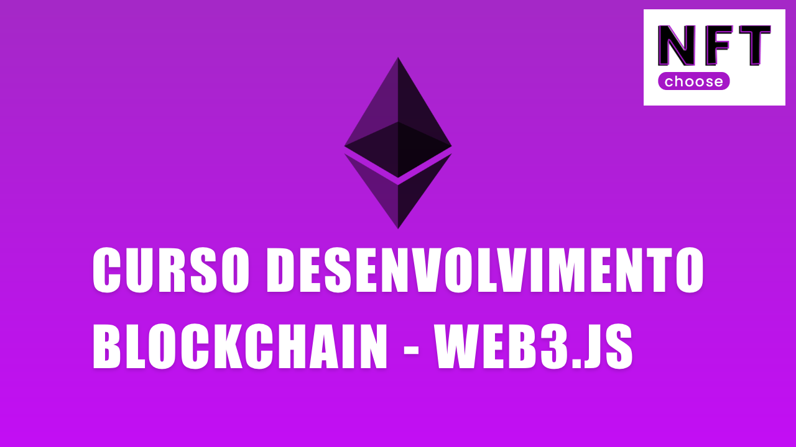

> Desenvolvimento blockchain com Web3.js

---

Aprenda utilizar a biblioteca web3.js de forma simples e rápida.

Esse repositório faz parte de uma serie do canal NFT Choose no YouTube. Você pode acompanhar a série no link abaixo:

Link: [https://www.youtube.com/watch?v=eNLbFAZ6AGc&list=PLPPrIZLm5juY45T-MbEdkvQh0HxSAjcmO](https://www.youtube.com/watch?v=eNLbFAZ6AGc&list=PLPPrIZLm5juY45T-MbEdkvQh0HxSAjcmO)

### Stack 🏭

- [Node](https://nodejs.org/en/)
- [Infura](https://infura.io/)
- [Web3js](https://web3js.readthedocs.io/en/v1.7.1/)
- [Ganache](https://trufflesuite.com/ganache/index.html)

